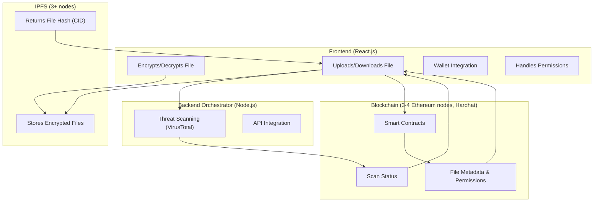

# Phase 1 Report: Planning & Architecture

**Project:** Decentralized Blockchain File Storage & Sharing Platform with Threat Intelligence  
**Phase:** 1  
**Period:** Project Kickoff & Foundation

---

## 1. Objectives

- Define the core vision, user stories, and acceptance criteria for the MVP.
- Select the frameworks and tools for each component.
- Draft the high-level system architecture and data flows.
- Establish repository structure and collaboration setup.

---

## 2. User Stories

- **As a user,** I can upload and encrypt files to decentralized storage so my data is secure and censorship-resistant.
- **As a user,** I can share files securely with other users by blockchain address.
- **As a user,** I want all files to be scanned for malware before sharing or downloading.
- **As a user,** I can view file safety status and scan reports.
- **As a user,** I can manage access permissions (grant/revoke).
- **As an admin,** I can monitor storage and node health.

---

## 3. Acceptance Criteria

- Users can upload encrypted files and receive a storage hash (CID).
- All files are scanned with a threat intelligence API; status is visible to users.
- Files can be shared with other addresses with on-chain permission checks.
- File metadata (owner, permissions, threat status) is stored on blockchain.
- Users can see a list of their files, permissions, and scan statuses.
- Admins can view node status and storage metrics.

---

## 4. Frameworks & Technology Stack

- **Smart Contract Framework:** Hardhat (Solidity, JavaScript, free & open-source)
- **Blockchain Network:** Ethereum testnet (Goerli or Polygon Mumbai), **3-4 blockchain nodes**
- **Frontend:** React.js (UI), ethers.js (blockchain), IPFS HTTP client (storage)
- **Decentralized Storage:** IPFS (3+ local nodes via Docker)
- **Backend:** Node.js (Express for API orchestration, Axios, dotenv, cors)
- **Threat Intelligence:** VirusTotal API (scanning via backend relay)
- **DevOps:** Docker Compose (multi-node, local simulation)
- **Testing:** Hardhat/Chai (contracts), Jest (backend/frontend)

---

## 5. High-Level Architecture



---

## 6. Repository Structure

```
project-root/
  contracts/       # Solidity contracts, Hardhat config
  frontend/        # React.js app
  backend/         # Node.js backend
  infra/           # Docker Compose, node configs
  docs/            # Documentation, specs, diagrams
```

---

## 7. Collaboration & Management

- **Repository:** Initialized with `.gitignore`, `README.md`
- **Docs:** All design docs in `/docs`
- **Project Board:** Set up for issues and phase tasks
- **Contributor Guidelines:** Add `CONTRIBUTING.md` and code style notes
- **Weekly Sync:** Regular standups for team

---

## 8. Deliverables for Phase 1

- [x] Documented user stories and acceptance criteria
- [x] Technology/framework selection finalized
- [x] High-level architecture diagram
- [x] Example contract data model (to be refined in next phase)
- [x] Initial repo with structure and documentation

---

## 9. Next Steps (Phase 2 Preview)

- Set up 3-4 local blockchain nodes and 3+ IPFS nodes using Docker and Hardhat.
- Scaffold the initial smart contract project.
- Implement basic connectivity and data flow between contracts, storage, and backend.
